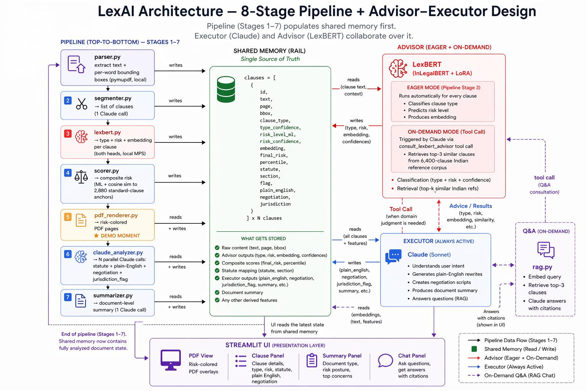

<p align="center">
  
</p>

# LexAI — AI-Powered Indian Legal Document Simplifier

An Indian-law-aware contract reader. Upload a rental agreement, employment contract, or consumer terms-of-service PDF, and LexAI surfaces risky clauses inline on the document, rewrites them in plain English, cites the specific Indian statute each clause violates, and generates exact negotiation language you can send back.

Built during **Hack O'Clock 2026** (18-hour hackathon, 2026-04-23).

---

## What it does

1. **Upload a PDF contract** (Indian rental / employment / consumer ToS)
2. **Risk-colored PDF in ~10 seconds** — red / amber / green overlays on each clause
3. **Plain-English rewrite** per flagged clause
4. **Indian statute + section citation** (Contract Act §27, TP Act §106, EPF Act §6, Arbitration Act §11, ID Act §25F, etc.)
5. **Negotiation script** — exact counter-language to send the other party
6. **RAG-based Q&A chat** — ask questions about specific clauses

End-to-end: ~20 seconds.

---

## Results

| Classifier | Classes | Test set size | Macro F1 |
|---|---|---|---|
| **Type head** | 10 clause types | 2,316 | **0.910** |
| **Risk head** | standard / aggressive / illegal | 640 | **0.797** |

Per-class F1 (type head, test set):

```
rent_escalation   0.97
probation         0.96
ip_ownership      0.96
arbitration       0.95
non_compete       0.95
eviction          0.89
pf_esic           0.89
notice_period     0.88
liability         0.87
termination       0.77
```

Full evaluation reports + confusion matrices: [`docs/eval/`](docs/eval/).

---

## Architecture

Follows Anthropic's **Advisor-Executor** pattern with real tool-use round-trip:

| Role | Component | Produces |
|---|---|---|
| **Advisor** | **LexBERT** — fine-tuned InLegalBERT + LoRA (0.28% of parameters trained) | Clause type (10-class) · risk level (3-class) · embedding |
| **Executor** | **Claude Sonnet 4.6** | Statute citation · plain-English · negotiation · jurisdiction flag |
| **Shared context** | Python `clauses = [{...}]` list | Both sides mutate the same dicts |

During per-clause analysis and Q&A, Claude can emit a `consult_lexbert_advisor` tool call to retrieve the top-3 most similar clauses from our 6,400-clause Indian reference corpus. LexBERT's embedding space grounds Claude's citations in retrieved evidence, not memory.

Full 8-stage pipeline:

```
PDF upload
  └─ parser.py         (pymupdf, text + word bboxes)
  └─ segmenter.py      (Claude, 1 call → clause list)
  └─ lexbert.py        (fine-tuned type head + risk head + base embedding)
  └─ scorer.py         (composite final_risk = ML + similarity to anchors)
  └─ pdf_renderer.py   (colored overlays per clause — the "demo moment")
  └─ claude_analyzer.py (N parallel Claude calls with tool-use)
  └─ summarizer.py     (Claude, 1 call → doc-level summary)
  └─ app.py            (Streamlit 3-column UI)

Q&A (on user question):
  └─ rag.py            (embed query → top-3 contract clauses + optional Advisor consult → Claude answer)
```

See [`docs/PIPELINE_FLOW.md`](docs/PIPELINE_FLOW.md) for ASCII flow + Mermaid + shared-memory rail diagrams.

---

## The dataset we built

**6,400 Indian contract clauses** (640 per class × 10 classes), statute-grounded, risk-labeled 45% standard / 35% aggressive / 20% illegal. First open-source Indian contract-clause corpus at this scale.

Lives in [`data/synthetic/`](data/synthetic/) as 10 JSONL files. Generator scripts: [`data/synthetic/generators/`](data/synthetic/generators/).

Each row:
```json
{
  "clause_text": "...",
  "clause_type": "non_compete",
  "risk_level": "illegal",
  "indian_law": "Indian Contract Act 1872 Section 27",
  "doc_type": "employment contract",
  "source": "synth_v2"
}
```

Supplementary: a LEDGAR slice (up to 500 rows per covered class) for structural contract-English grounding. Fetched automatically by `scripts/download_ledgar.py`.

---

## Installation

Needs Python 3.9+. MPS (macOS Apple Silicon) or CUDA recommended for training; CPU works for inference.

```bash
# 1. Clone + enter
git clone https://github.com/Abhilash-003/AI-Powered-Legal-Document-Simplifier-HackOClock.git
cd AI-Powered-Legal-Document-Simplifier-HackOClock

# 2. Create virtualenv
python3 -m venv .venv
source .venv/bin/activate

# 3. Install dependencies
pip install -r requirements.txt

# 4. Configure LLM provider
cp .env.example .env
# edit .env and paste your OpenRouter or Anthropic key

# 5. Verify LLM config (makes a test call + validates tool-use)
python3 scripts/verify_llm_config.py
```

---

## Quick start — CLI classifier (no training required once models are present)

```bash
# Batch-classify 6 canned samples
python3 scripts/quick_demo.py

# Paste your own clauses
python3 scripts/interactive_demo.py
```

Both auto-activate the venv if you forget.

> These scripts require the fine-tuned models in `models/lexbert-type/` and `models/lexbert-risk/`. Model weights are not in git (too large) — see training instructions below.

---

## Full pipeline (Streamlit UI)

```bash
streamlit run app.py
```

Upload a PDF, watch the risk overlays appear, click any highlighted clause, ask questions.

---

## Training from scratch

~3 hours total on Apple M-series MPS. Approximate stage times:

```bash
# 1. Download the LEDGAR supplementary corpus
python3 scripts/download_ledgar.py

# 2. Build train/val/test splits combining Indian synthetic + LEDGAR
python3 scripts/build_training_set.py

# 3. Train the type head (10-class clause taxonomy)    ~1 hour
python3 scripts/train_lexbert.py --head type --batch_size 32 --epochs 8

# 4. Train the risk head (3-class: standard/aggressive/illegal)    ~30 min
python3 scripts/train_lexbert.py --head risk --batch_size 32 --epochs 8

# 5. Merge LoRA adapters into base model for inference
python3 scripts/finalize_type_model.py
python3 scripts/finalize_risk_model.py

# 6. Precompute standard-clause reference embeddings (for similarity scoring)
python3 scripts/build_reference_embeddings.py

# 7. Evaluate on held-out test sets
python3 scripts/eval_lexbert.py --head type
python3 scripts/eval_lexbert.py --head risk
```

### Training recipe (from Paul et al., 2023)

```
base_model        = law-ai/InLegalBERT (BERT-base, pretrained on 5.4M Indian legal docs, 27 GB)
LoRA rank         = 8
LoRA alpha        = 16
LoRA dropout      = 0.1
target modules    = ["query", "value"]       # BERT attention only
trainable %       = 0.28% (297K / 110M params)

batch_size        = 32
max_seq_length    = 384 (fixed padding — prevents MPS kernel thrash)
epochs            = up to 8, early stopping patience 3
lr_classifier    = 1e-3      # 100× gap — keeps encoder stable
lr_encoder       = 1e-5
weight_decay     = 0.01
label_smoothing  = 0.1
loss             = Weighted cross-entropy (inverse class frequency)
```

---

## Repository layout

```
src/                          # 11 pipeline modules
├── parser.py                 # PDF → text + word bboxes (pymupdf)
├── segmenter.py              # Claude: 1 call → clause list + char offsets
├── lexbert.py                # Fine-tuned type + risk head inference
├── embedder.py               # Base InLegalBERT [CLS] embedder (shared)
├── scorer.py                 # Composite risk scoring (ML + similarity)
├── legal_advisor.py          # LexBERT retrieval index over 6,400 Indian clauses
├── claude_analyzer.py        # N parallel Claude calls with `consult_lexbert_advisor` tool-use
├── summarizer.py             # Doc-level summary (Claude, 1 call)
├── pdf_renderer.py           # PDF pages + colored risk overlays (pymupdf + PIL)
├── rag.py                    # Q&A: clause retrieval + Advisor tool-use + Claude answer
└── pipeline.py               # Orchestrator

app.py                        # Streamlit 3-column UI

scripts/
├── train_lexbert.py          # Fine-tuning entrypoint
├── finalize_type_model.py    # Merge LoRA into base for deployment
├── finalize_risk_model.py
├── build_training_set.py     # Merge + stratify Indian synth + LEDGAR
├── build_reference_embeddings.py
├── download_ledgar.py        # Pulls LEDGAR from coastalcph/lex_glue
├── build_indian_synth.py     # Dataset synthesis (original)
├── eval_lexbert.py           # Held-out test evaluation
├── quick_demo.py             # Batch CLI classifier
├── interactive_demo.py       # Live CLI classifier (paste a clause, get predictions)
├── verify_llm_config.py      # LLM provider health-check
└── make_architecture_diagram.py

data/
├── synthetic/                # Our 6,400-clause Indian contract corpus (10 JSONL files)
│   └── generators/           # Scripts that generated the corpus

docs/
├── pitch/                    # Deck, pitch notes, flow diagrams, review Q&A
├── eval/                     # Evaluation reports + confusion matrices
├── superpowers/specs/        # Design spec
└── RESEARCH_PRIOR_ART.md     # Prior-art survey

models/                       # (gitignored — too large) Trained model weights go here
data/raw/                     # (gitignored) Raw downloads (LEDGAR, Kaggle, PDFs)
data/processed/               # (gitignored — reproducible) Parquets + reference embeddings
```

---

## Key engineering choices

- **LoRA, not full fine-tune** — 0.28% of params trainable; base InLegalBERT is structurally frozen → catastrophic forgetting is impossible by construction.
- **Per-layer learning rates** (head 1e-3 / encoder 1e-5, 100× gap) — from Paul et al.'s InLegalBERT paper; keeps pretrained Indian-legal knowledge stable.
- **Fixed-length padding** (max 384) — prevents MPS kernel cache thrash that would otherwise cause 5-15× slowdowns.
- **Claude-based clause segmentation, not regex** — Indian contracts have WHEREAS preambles, nested numbering, run-on paragraphs. Regex breaks; one Claude call handles any format robustly.
- **Tool-use round-trip for Advisor consultation** — Claude emits `consult_lexbert_advisor` tool calls; runtime runs LexBERT embedding retrieval over our 6,400-clause corpus; Claude grounds citations in retrieved evidence.
- **Parallel Claude calls, not one mega-call** — `asyncio.gather` across N clauses; ~6× faster wall latency than sequential generation.
- **RAG over clause embeddings** — reuses the base InLegalBERT encoder for Q&A retrieval; no vector database; works on 100-clause contracts.

---

## Limitations

- **Synthetic training data** — all 6,400 clauses are Claude-generated with statute-grounded prompts. Real contracts have OCR noise and unusual phrasings we don't see in training. Real-world validation is future work.
- **"Illegal" class is synthetic by construction** — real contracts aren't shared as "here's my illegal clause." Whether courts would strike these down is model belief, not tested jurisprudence.
- **English only** — no Hindi or regional language support.
- **Contracts sent to Anthropic's API** — on-device-only inference is future work.
- **Type head `termination` class weakest (0.77 F1)** — confuses with `notice_period`; both employment-language.

---

## License

[MIT](LICENSE).

---

## Acknowledgements

- [law-ai/InLegalBERT](https://huggingface.co/law-ai/InLegalBERT) — Paul, Mandal, Goyal, Ghosh (IIT Kharagpur, 2023). Base model pretrained on 5.4M Indian legal documents.
- [LEDGAR](https://aclanthology.org/2020.lrec-1.155/) — contract clause benchmark, via the LexGLUE release.
