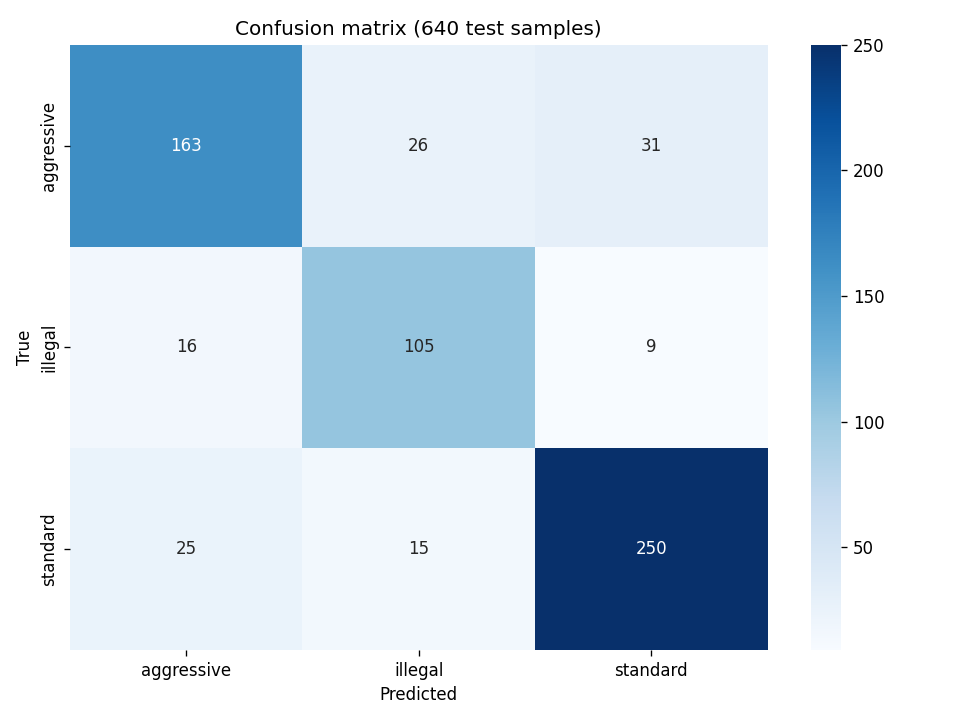

# Risk classifier — evaluation

Fine-tuned `law-ai/InLegalBERT` with LoRA adapter (rank 8, alpha 16, 0.28% of params trainable) on a 3-class ordinal risk taxonomy (standard / aggressive / illegal). Held-out test split: 640 clauses, stratified by risk level.

## Headline numbers

| Metric | Value |
|---|---|
| **Macro F1** | **0.7973** |
| Weighted F1 | 0.8095 |
| Accuracy | 0.81 |

## Per-class F1

| Class | F1 |
|---|---|
| standard | 0.862 |
| aggressive | 0.769 |
| illegal | 0.761 |

All three classes above 0.76. Adjacent-class confusion (aggressive ↔ illegal, standard ↔ aggressive) accounts for most of the residual error — expected for an ordinal task where the boundary between categories is inherently gradient.

