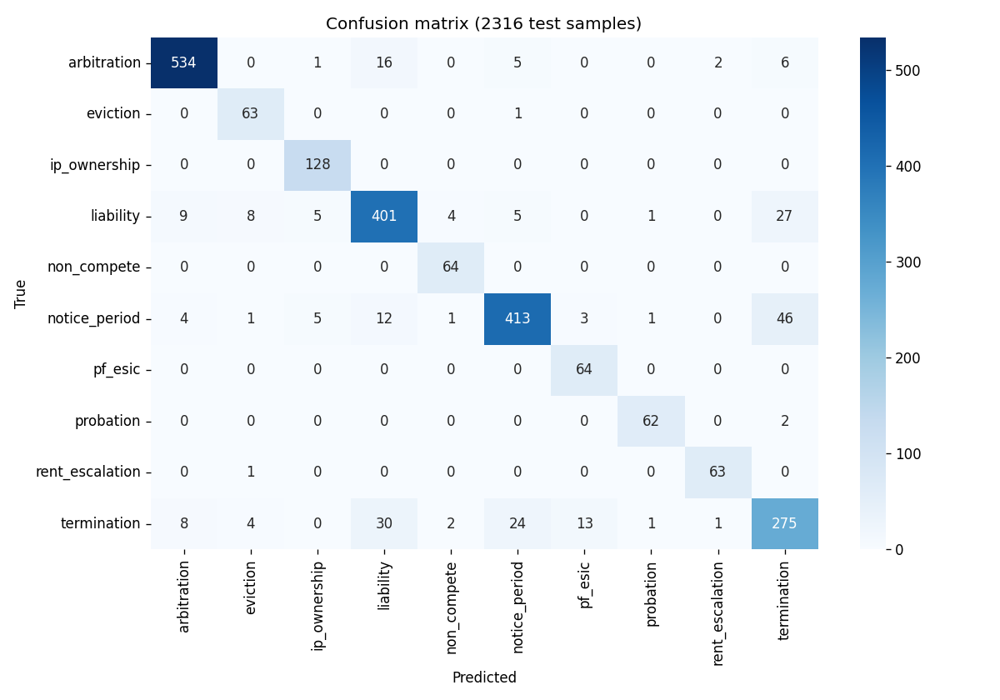

# Type classifier — evaluation

Fine-tuned `law-ai/InLegalBERT` with LoRA adapter (rank 8, alpha 16, 0.28% of params trainable) on a 10-class Indian contract clause taxonomy. Held-out test split: 2,316 clauses, stratified by class.

## Headline numbers

| Metric | Value |
|---|---|
| **Macro F1** | **0.9102** |
| Weighted F1 | 0.8922 |
| Accuracy | 0.89 |

## Per-class F1 (descending)

| Class | F1 |
|---|---|
| rent_escalation | 0.969 |
| probation | 0.961 |
| ip_ownership | 0.959 |
| arbitration | 0.954 |
| non_compete | 0.948 |
| eviction | 0.894 |
| pf_esic | 0.889 |
| notice_period | 0.884 |
| liability | 0.873 |
| termination | 0.770 |

Weakest class — *termination* — confuses primarily with *notice_period* (both employment-language). All other classes above 0.87.

